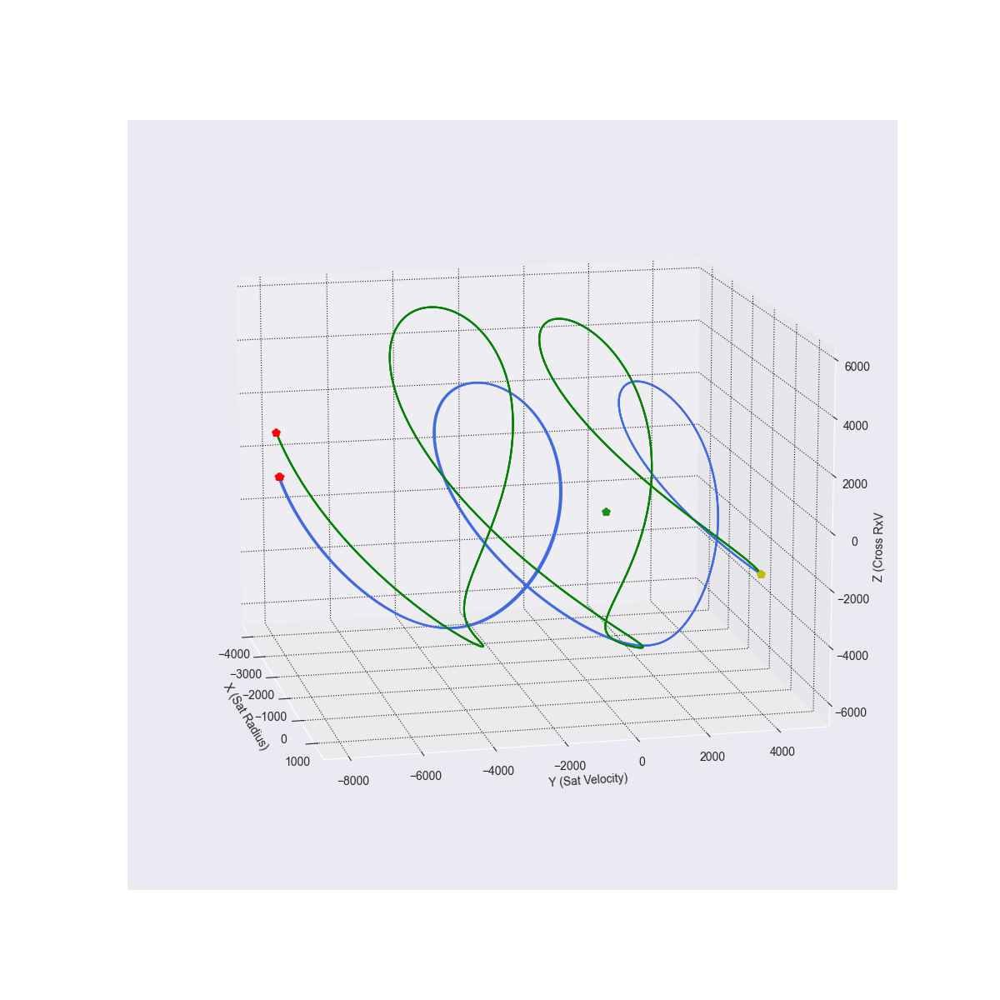
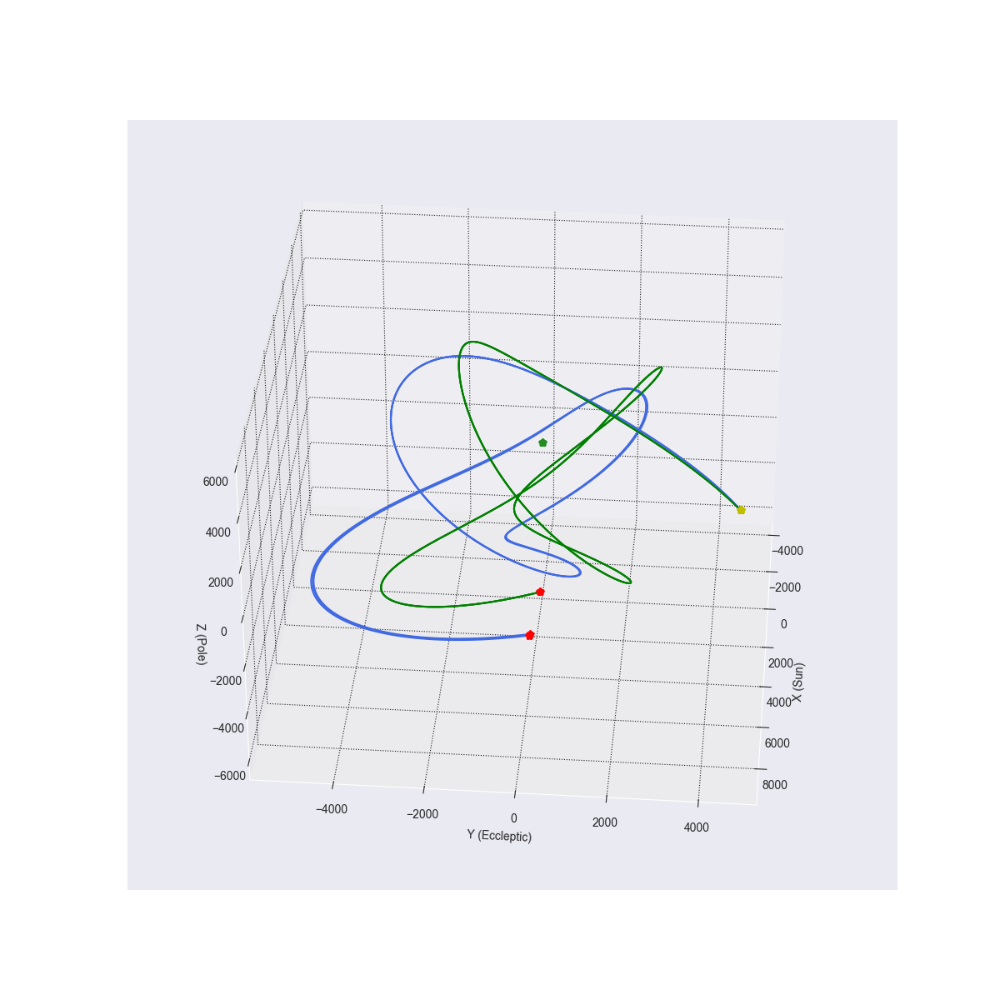

# ApparentOrbitalMotionExplorer

This project is intended to optimize Apparent Orbital Motion. The apparent orbital motion is the virtual trajectory a satellite follows relative to another satellite. For example, even though two satellites have their own trajectory around the Earth, one can appear to revolve around another. If two satellites have the same period, but different eccentricity, one will appear to orbit around the other.

This project provides optimizers to find which orbital parameters of two satellites match a given apparent motion the best. The project contains an orbit simulator, as well as visualizers.

Two frames of reference are used: 
- Earth-centric
- LVLH (Local Vertical Local Horizontal)

In the Earth-centric frame of reference, the X-Y-Z frame is centered on the Earth and X coordinates point at the Sun, Z coordinates point up from the eccliptic and the Y coordinate is the cross product of X and Z.

In the LVLH frame of reference, the parent satellite is the center of the coordinate system. The X coordinate is pointing away from the center of the Earth to the parent satellite. The Y coordinates are the direction of the velocity of the Parent satellite and Z coordinates is the cross product of X and Y.

In terms of apparent motion, the trajectory is simply the difference between Xs, Ys and Zs of both satellites. In Earth-centric reference frame, no further modification is necessary. In LVLH reference frame, we further transform the trajectory to be relative to the satellite. This is important, because the reference frame is rotating as the Parent satellite is orbiting the Earth. The X coordinates and Y coordinates vary according to different parameters.

The orbit simulator uses a basic Keplerian method for finding the next position and velocity at the next time step. Although this is less precise than simply going by a very mechanical method, summing forces and calculating the next position by seeing how the satellite is affected, our use cases do not require yet this level of precision. But regardless, the system has been built in a way tp abstract the computation methods. So it can be easily replaced in the future.

The simulator can use two descriptions of the orbital parameters. The classical orbital elements and Cartesian orbital position and velocity. This allows us to define our orbits in two different ways, depending on the use case.

## Visualization

### LVLH visualization

This visualization shows the intended apparent motion in green and the top N solutions in blue. The Green star is the Parent satellite. The yellow star is the starting position of the child satellite on both the green and blue curves. The red star is the ending position of the child satellite on both the blue and green trajectories.

This specific example shows the result of an optimization where the optimizer is only given the intended starting relative position of the child satellite and was able to discover the intended trajectory.

### Earth-centric visualization

This visualization has the same color code as the previous one. The difference is that the reference system is Earth-centric. You can see how both trajectories evolve relative to the parent satellite and the Earth simultaneously. Both images here refer to the same apparent motion.
